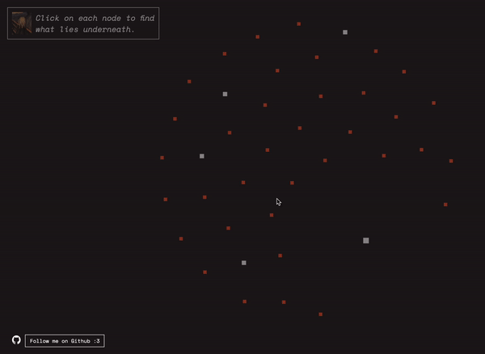

# A Data Visualizer Series Implementation

https://user-images.githubusercontent.com/49734520/148604528-4bec85b5-cb27-46fd-9718-596a2e185e85.mp4     

Ever need a refresher with how egregious the student loan industry has become? 
How about just getting a bigger picture of the subject? 
Well fret not, this website is here to do just that. 
This shows the relationships between the central topics emerging since the conception of the industry and the cause and effects of known themes. 
Although this personal-guided research shows a general bigger picture, it is not intended to be used as an official material! 
It is simply a show of design, data, and discussion bundled up together. 
This is made with HTML, CSS, Javascript, [d3.js](https://d3js.org/), and the [New York Times Article Search API](https://developer.nytimes.com/docs/articlesearch-product/1/overview)

   
To start:   
Simply hover over a node to view its name and its connections.
It is recommended that you start with the biggest and the most isolated node.  
 
 
White nodes indicate a key point that is essential to such groups and connections, while orange nodes indicate subpoints; 
whereas orange nodes provide a more specific point, white nodes provides the more overarching themes.  
 
 
 

   
### Informational Popouts ###
Click on a node to find what lies underneath. The popout explains how and why a given point relates to the overarching theme and its connections. With the popout, one can see the image, the text description, and it is also fully draggable.      
    
### Suggested Feed: Articles ###
Articles listed are fetched through the New York Times Article Search API. Note that the articles suggested are simply queried by fetching the API with the topic name as the query parameters. As such, it may or may not be possible that the feeds suggested may be relevant to the actual topic.   
  
## Acknowledgements

 - [Awesome Readme Templates](https://awesomeopensource.com/project/elangosundar/awesome-README-templates)
 
